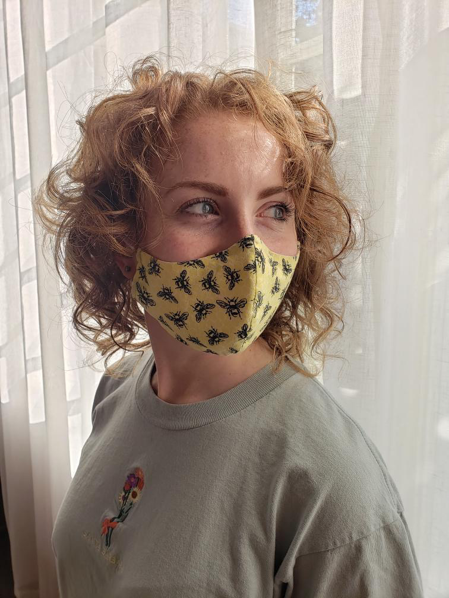
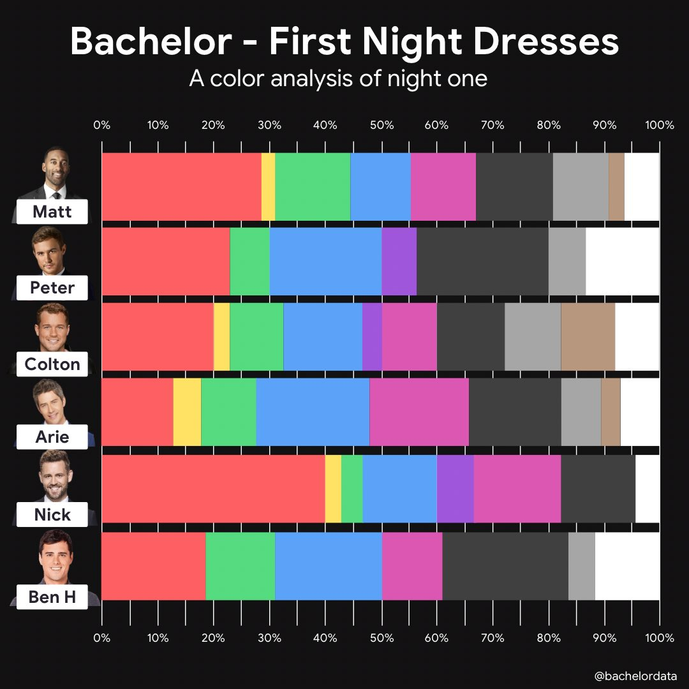
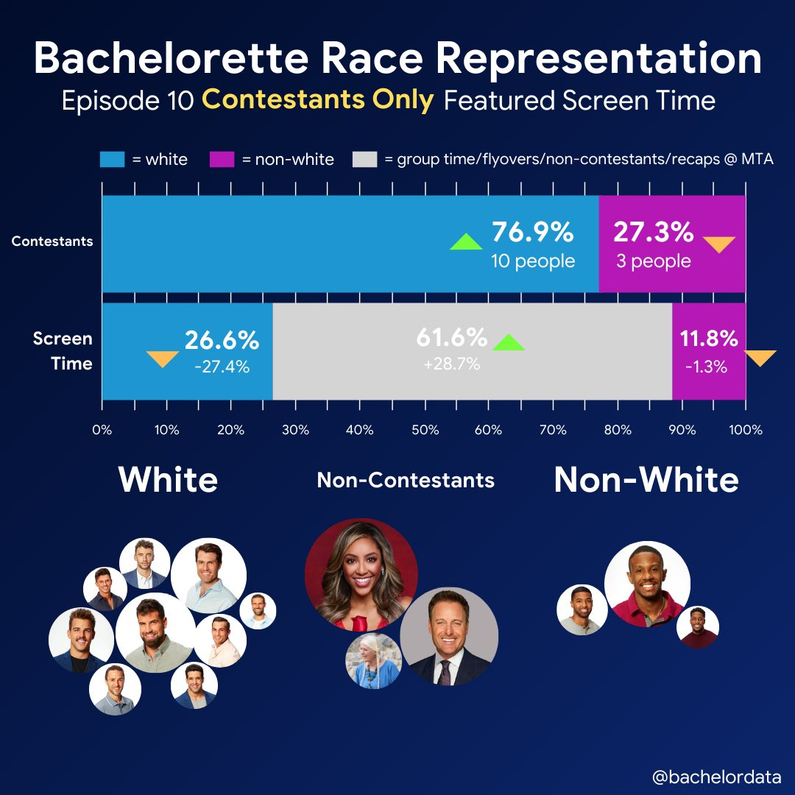

## Amanda Glatter
#### Lab Technician, B.S. Environmental Health

### My Background
I graduated from UGA in Spring 2020 with a **B.S. in Environmental Health** and a minor in Spanish. I chose environmental health because it connects three of my passions: environmental protection, public health, and social justice. Currently, I am a full time lab technician in Dr. Erin Lipp's lab working on the **Community Resistance in Athens Project**, which is focused on examining the carriage rates of multi-drug resistant _E. coli_. During my undergraduate experience, I studied abroad in Costa Rica, where I conducted independent resesarch on environmental _E. coli_ concentrations and gained a thorough background in ecology. Other experiences include volunteering in a lab at the Odum School of Ecology, founding Theta Nu Xi Multicultural Sorority, Inc., and interning at the Florida Department of Health and the Athens-Clarke County Water Conservation Office. I am in the process of applying to graduate school for a MPH in Epidemiology with a focus on infectious disease. My goal for graduate school is to gain the quantitative and analytical tools necessary to address global environmental health threats.

### Statistical Experience and Goals
I have used Microsoft Excel to model data from my undergraduate research and I have used R to model preliminary findings for my current position in the Lipp Lab. I have taken a few Code Academy courses in R, but I would consider myself a beginner level R user. A few of my goals for this course are to learn how to approach modeling large data sets and run statistical analyses. I would also like to establish a more efficient way to organize data in spreadsheets before uploading them to R.

### Interests and Hobbies
Outside of work and school, I enjoy:

* Yoga
* Listening to music and podcasts
* Cooking
* Playing guitar
* Volunteering for the Upper Oconee Watershed Network. I hope to use the skills I gain from this class to share UOWN's data with the public more effectively!

### Fun Facts
I love theatre and I performed in several musicals in  college. When I was younger, I did some voiceover acting for commercials and was very involved in the drama department at school.

### Link
The [Bachelor Analyst](https://twitter.com/bachelordata) twitter account  is an excellent representation of how data analysis can be used as a tool to enhance the viewing experience of the popular reality TV show, "The Bachelor." @BachelorData shares beautiful analyses of the competition and breaks down each episode by activity and air times of contestants. In addition, this account  identifies shortcomings of representation within the show. This  shows how data modeling can enhance experiences outside of academia and scientific research. 

     

     
     
     
##############################################
(The following code is a work in progress as of 11/7/21, I appreciate your patience as we are under construction!)
<html>
<head>

</head>
<body>

  

    
  

  

    
  

</body>
</html>
